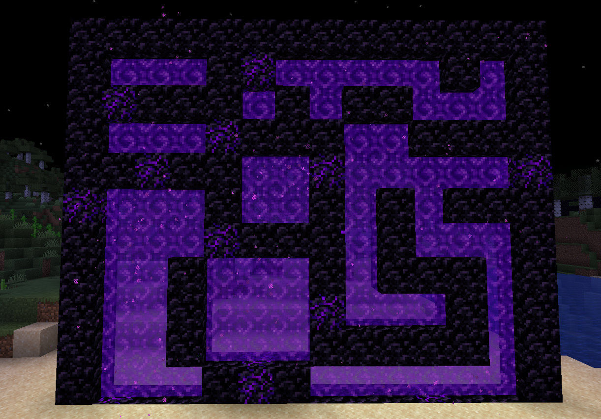

<div align="center">



# ShapedPortals

Free-form Nether portals with durable registration, configurable presentation, and complete in-game administration.

</div>

## Features

- **Arbitrary portal shapes** — Ignite bounded vertical Nether portals with irregular, concave, or asymmetric interiors.
- **Vanilla-compatible creation** — Vanilla receives the first creation opportunity, and proposed shaped portals fire Bukkit's `PortalCreateEvent` so protection plugins can cancel them.
- **Managed integrity** — Portals persist across restarts, repair replaceable portal cells, and retain their recorded frame materials when the creation whitelist changes.
- **Hot-reloadable configuration** — Every persisted option is available in the 54-slot in-game editor and can also be edited in `config.toml` without a restart.
- **Localization** — Code-owned English remains available offline; 17 additional locale files download only when selected and remain directly editable afterward. Messages accept classic `&` colors, RGB, and MiniMessage.
- **Administration** — Paginated portal listings, safe and permission-gated forced teleportation, and comprehensive local diagnostics with optional mclo.gs upload.
- **Cooperative presentation** — Configurable chat, action-bar, title, boss-bar, and sound feedback respects VolmLib's shared HUD claims.
- **Metrics** — Enabled-by-default bStats metrics retain both plugin-local and global opt-outs; optional React Plugin API Pack metrics stay on the server.

## Requirements

- Minecraft 1.20.1 or newer.
- Spigot, Paper, Folia, or a compatible derivative.
- Java 17 bytecode support; use the newer Java runtime required by the server version when applicable.
- Optional: React, when the ShapedPortals Runtime Plugin API Pack is installed for dashboard samplers.

## Commands

`/shapedportals` is the root command, with `/shapedportal` and `/sp` as aliases.

| Command | Result |
|---|---|
| `/sp` | Open the localized paginated help menu. |
| `/sp status` | Show creation, registry, scheduler, and integration state. |
| `/sp config` | Open the complete in-game configuration and language editor. |
| `/sp language [locale]` | Select a locale or open the clickable language picker. |
| `/sp portals [page]` | List managed portals with frame status and teleport shortcuts. |
| `/sp teleport [UUID/prefix]` | Teleport safely beside a managed portal; authorized operators may confirm an unsafe landing. |
| `/sp debug` | Save a diagnostic report and optionally upload the saved report to mclo.gs. |

## Building

```text
./gradlew build                 # full gate, shaded jar, and workspace BUILDS copy
./gradlew shadowJar             # shaded plugin jar only
./gradlew publishToMavenLocal   # verified plugin and sources in local Maven
```

The build runs on Java 25 and emits Java 17 bytecode. A sibling `VolmLib` checkout is resolved automatically as a composite build; pass `-PuseLocalVolmLib=false` to use the configured remote dependency instead.

The versioned plugin is written to `build/libs/ShapedPortals-2.0.0.jar`. Successful full builds also refresh `C:/VolmitSoftware/BUILDS/ShapedPortals.jar`, and the React API Pack is copied to `build/distributions/react-api-packs/`.

## Data layout

ShapedPortals creates its configuration and English fallback on first start. Other files and folders appear only when their feature has data to store.

```text
plugins/ShapedPortals/
├── config.toml                              all runtime settings; always
├── languages/en_US.toml                    editable English fallback; always
├── languages/<locale>.toml                 selected repository or custom locales
├── portals.json                            persisted managed portals, after the first registry write
└── debug/shapedportals-debug-<time>.txt    locally saved `/sp debug` reports
```

`config.toml` and installed language files hot-reload. Repository locales are checksum-verified only when first installed and are never automatically replaced after local edits.
